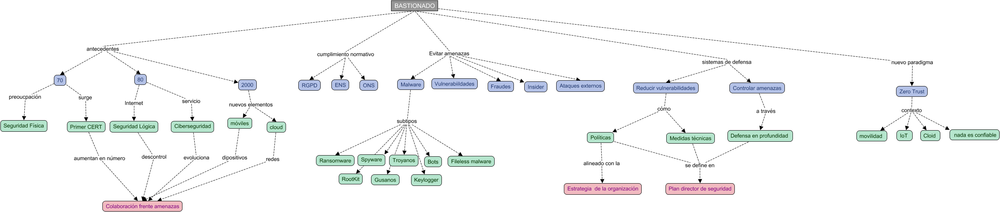

# Bastionado de Redes y Sistemas: Fundamentos y Estrategia

> **ID:** NDC-BAST-01  
> **Tema:** Introducción al Bastionado (Hardening) y Planes de Seguridad  
> **Caso Práctico:** Venus SA (Clínica de Cirugía Estética) & Juan (Incidente de Ransomware)

---

## 📖 1. Introducción y Contexto Histórico
El bastionado no es solo una configuración técnica; es una respuesta a la evolución de las amenazas. Desde el origen del correo electrónico hasta la actualidad, los vectores de ataque han crecido exponencialmente.

### Hitos de la Ciberseguridad
* **Años 70-80:** Seguridad principalmente física. Hitos como el **Gusano de Morris** y el virus **Creeper** dieron lugar a la creación del primer **CERT** (Computer Emergency Response Team).
* **Años 90:** Expansión de Internet y externalización de servicios. La seguridad lógica cobra importancia.
* **Actualidad:** Entorno hiperconectado (Cloud, IoT, Smartphones) y profesionalización del cibercrimen.

---

## 📋 2. La Necesidad del Bastionado
El objetivo es proteger las tres dimensiones de la seguridad (**CIA**): **Confidencialidad, Integridad y Disponibilidad**. Además, existen imperativos legales como el **RGPD** (Reglamento General de Protección de Datos).

### Amenazas Comunes
| Tipo de Amenaza | Descripción |
| :--- | :--- |
| **Ransomware** | Secuestro de datos mediante cifrado para solicitar rescate. |
| **Spyware** | Recopilación de información y hábitos del usuario (ej. Pegasus). |
| **Bots/BotNets** | Redes de equipos "zombis" controlados remotamente para ataques DDoS. |
| **Fileless Malware** | Uso de herramientas legítimas del SO (PowerShell) para atacar. |
| **Insiders** | Amenazas internas (empleados con acceso que roban información). |

> **Vulnerabilidad vs. Amenaza:** > Una **Amenaza** es un daño potencial (ej. un hacker), mientras que una **Vulnerabilidad** es un fallo en el sistema (ej. usar credenciales por defecto) que permite que la amenaza se materialice.

---

## 🛡️ 3. El Concepto de Bastionado (Hardening)
El bastionado es el proceso de reducir la superficie de ataque de un sistema eliminando funciones innecesarias y reforzando las existentes para lograr una **Defensa en Profundidad (DiD)**.

### Características Clave:
* Eliminación de cuentas y contraseñas por defecto.
* Instalación de **WAFs** (Web Application Firewalls) y Firewalls perimetrales.
* Políticas estrictas de actualizaciones y parches de seguridad.
* Deshabilitación de servicios y puertos no utilizados.
* Planes de contingencia y copias de seguridad.

---

## 🔐 4. El Paradigma "Zero Trust" (Confianza Cero)
Evolución del principio de "mínimo privilegio". En este modelo, **no se confía en nada ni en nadie por defecto**, incluso si la conexión proviene de la red interna.

### Pilares de Zero Trust:
1.  **MFA/2FA:** Autenticación de múltiples factores.
2.  **Microsegmentación:** Control del flujo de red entre activos específicos.
3.  **Acceso Discrecional:** El usuario solo ve las aplicaciones necesarias, no la red completa.
4.  **Detección Avanzada:** Identificación de amenazas "Zero Day".

---

## 📈 5. Plan Director de Seguridad (PDS)
Un PDS es el conjunto de actividades técnicas y organizativas alineadas con la estrategia de negocio para reducir riesgos a un nivel aceptable.

### Ciclo de Mejora Continua (PDCA)
La seguridad no es un estado, es un proceso iterativo. Tras implementar medidas, se debe volver a evaluar.

### ¿Por dónde empezar?
Todo plan debe iniciarse con un **Análisis de Riesgos**. No se puede proteger lo que no se conoce. 
* **Herramienta recomendada:** Herramienta de autodiagnóstico de **INCIBE**.
* **Variables:** Personas, Procesos y Tecnologías.

---

## 💡 Autoevaluación
**Pregunta:** ¿Cuál de los siguientes no es un motivo para implementar bastionado?
1. Por normativa legal.
2. La seguridad es un requisito indispensable.
3. RGPD.
4. **Los técnicos lo consideran necesario.** (Correcto: El bastionado debe responder a una estrategia de negocio y riesgo, no solo a la opinión técnica aislada).

**Pregunta:** Para aplicar seguridad a un sistema, ¿por dónde empiezo?
* **Respuesta:** Realizando un **Análisis de riesgos**.

---

## 🏢 Caso Práctico: Venus SA
**Escenario:** Clínica estética con dependencia tecnológica baja y 10 empleados.  
**Desafío:** Implementar un Plan Director de Seguridad que considere la protección de historiales médicos (RGPD) incluso si están en formato físico o digitalizado, alineando la seguridad con la operativa diaria de la clínica.
