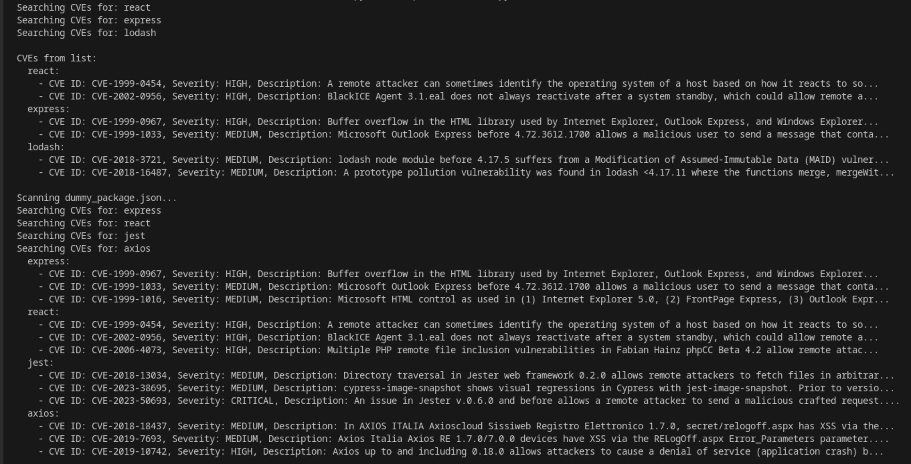

# 🐍 Python Vulnerability Scanner: NIST/NVD Integration

Este módulo es el núcleo técnico de mi **proyecto de auditoría**. Se trata de un script en Python diseñado para automatizar la consulta de vulnerabilidades (CVEs) directamente desde la base de datos del **NIST**, optimizado mediante **IA** para filtrar la relevancia de las dependencias analizadas.

---

## 🚀 Funcionalidad del Script
El script toma un listado de dependencias críticas de un proyecto y realiza peticiones asíncronas a la API de la **National Vulnerability Database**. Su objetivo es identificar fallos de seguridad conocidos antes de que puedan ser explotados en una fase de producción.

### Flujo de Trabajo:
1.  **Input:** Definición de dependencias (ej. `Cypress`, `Django`, `Requests`).
2.  **Consulta API:** Conexión con `services.nvd.nist.gov`.
3.  **Procesamiento IA:** Uso de modelos de lenguaje para resumir descripciones técnicas complejas y priorizar según el contexto del proyecto.
4.  **Output:** Reporte estructurado de severidad y criticidad.

---

## 📊 Ejemplo de Respuesta (Audit Log)

Cuando el script identifica una coincidencia, genera un reporte con el siguiente formato, facilitando la toma de decisiones inmediata:

---

## 🛠️ Stack Tecnológico
* **Lenguaje:** Python 3.x
* **Librerías:** `requests` / `httpx` para consultas a la API.
* **Fuentes de Datos:** NIST NVD API v2.0.
* **IA Integration:** Procesamiento de lenguaje natural (NLP) para el análisis de la severidad e impacto real en el entorno auditado.

---

## 🔍 Aplicación en el Proyecto de Auditoría
Este script no es solo una herramienta de consulta; es parte de mi metodología de **Gestión de Vulnerabilidades**. Me permite:
* Realizar auditorías de dependencias en tiempo récord.
* Mantener un inventario de activos actualizado con sus respectivos riesgos asociados.
* Generar alertas tempranas (Indicadores) dentro de mi flujo de trabajo de **Incident Response**.

---
> **Nota de Auditoría:** Las consultas están limitadas por el *rate limit* de la API del NIST. Para un rendimiento óptimo en auditorías de gran escala, se recomienda el uso de una API Key oficial.